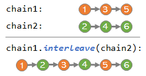

# Chainable

> :warning: Under construction / Work in progress / Coming soon...

## Overview

`Chainable` is intended to be a richer, `Iterable`-based alternative to Java's `Stream` and Google's *guava* focused on sequence and tree processing specifically. It is heavily inspired by the **iterator pattern**, **functional programming**, **lazy evaluation** and C#'s `Enumerable`, but also extended into areas of functionality not addressed by older approaches. It is intended to enable writing code that is more succinct, readable, simpler to implement, and sometimes faster than its non-lazy/non-functional equivalents.

```java
        Chainable<String> chain = Chainable
                .from(0, 0, 0, 2, 3, 7, 0, 1, 8, 3, 13, 14, 0, 2)     // Integers
                .notAsLongAs(i -> i == 0)                             // Ignore leading sub chain of 0s
                .notAfter(i -> i == 13)                               // Stop after finding 13
                .whereEither(                                         // Choose only those that...
                        i -> i % 2 == 0,                              // ...are even
                        i -> i > 6)                                   // ...or greater than 6
                .transform(i -> Character.toString((char) (i + 65))); // Transform into letters

        String text = chain.join(); // Merge into a string
        String textBackwards = chain.reverse().join(); // Reverse and merge into a string

        assertEquals("CHAIN", text);
        assertEquals("NIAHC", textBackwards);
```

The implementation is lightweight and self-contained, i.e. it has no external dependencies, so as not to contribute to any sub-dependency versioning challenges.

(A note on the terminology: `Chainable` is the interface, whereas the word *"chain"* is used throughout the documentation to refer to specific instances of `Chainable`).

### Chainable vs Java Stream

Although `Chainable` overlaps with Java's `Stream` in some areas of functionality, the design of `Chainable` is optimized for a somewhat different set of goals and aligns more with C#'s `Enumerable`'s LINQ-style methods than Java streams. Additionally, *chainable* provides functional programming-based API for trees (or mroe specifically, *tries*), seamlessly integrated with its sequence processing API, as well as other (future) basic data structures.

Another key difference from `Stream` is that `Chainable` fully preserves the functional and re-entrancy semantics of `Iterable`, that is it can be traversed multiple times, with multiple iterator instantiations, whereas Java's built-in `Stream` can be traversed only once.

The `Chainable` API surface also exposes various additional convenience methods for sequential chain processing with functional programming, and not (currently) so much oriented toward the parallelism that was a key guiding design principle behind Java's `Stream`. Also, some of the overlapping APIs are only available in Java streams starting with Java 9, whereas `Chainable` is fully functional starting with Java 8.

Having said that, a level of interoperability between `Stream` and `Chainable` exists: a chain can be created from a stream (see `Chainable#from(Stream)`, and vice-versa (see `Chainable#stream()`). A stream wrapped in a Chainable appears reentrant, even though it is traversed only once: the chain wrapper caches the already evaluated values and only accesses the underlying stream for not yet visited items.

### Highlights

Besides the part of the API overlapping with streams, current highlights of `Chainable` include:

#### Sequence processing
> :warning: Section under construction as the API is under active development/at pre-release stage.

- **interleaving** (see `Chainable#interleave`) - two or more chains that have their own evaluation logic can be interleaved,
so that subsequent chain can apply to their outputs in a quasi-parallel (or sequential round-robin) fashion, so as not to have a bias toward one chain first, while still not actually being concurrent.


- **breadth-first/depth-first traversal** - enabling tree-like traversals of a chain of items, where children of an item are dynamically added by the caller-specified child extractor and traversed either breadth-first (queue-like, `Chainable#breadthFirst()`) or depth-first (stack-like, `Chainable#depthFirst()`), both in a lazy fashion.

- **single pass caching** - by default, each re-iteration over a given chain re-evaluates the lambdas, just like in a typical `Iterable`. But it is possible to create a chain that is lazy-evaluated only on the first pass, i.e. when it is iterated all the way to the end (see `Chainable#cached()`). From then on, subsequent iterations over the same chain would only navigate through the internally cached outputs of that initial pass, no longer evaluating the provided lambdas. That means the cached chain, upon subsequent traversals, starts behaving like a collection. 

- **disjunctive filtering** - you can specify one or more filter predicates at the same time (see `Chainable#whereEither`), with disjuctive (logical-OR) semantics. This means you can define specific filtering predicates for specific purposes and then just supply them all as parameters, rather than having to create yet another predicate that's an *OR* of the others.

- **skipping** of the leading sub-chain of items under various scenarios, e.g.:
  - skip *as long as* they satisfy a condition (`Chainable#notAsLongAs()`)
  - skip *before* they satisfy a condition (`Chainable#notBefore()`)
  
- **trimming** of the trailing sub-chain of items under various scenario, e.g.:
  - stop *as soon as* the specified conditions are satisfied (`Chainable#asLongAs()`)
  - or are no longer satisfied (`Chainable#before()`.)

- **equality and sub-array containment** checks, but evaluated lazily, i.e. chains failing the equality (`Chainable#equals`) or sub-array containment (`Chainable#containsSubarray`) tests return quickly, without traversing/evaluating the rest of the chain.

- chainable **string joining/splitting** operations - you can quickly get a chain of tokens or characters out of a string (see `Chainables#split()`, process it using `Chainable` APIs and go back to a string (see `Chainable#join()`).

#### Tree processing

> :triangular_flag_on_post: To do...

## System requirements

- Java 8+

## Usage (Maven)

> :triangular_flag_on_post: To do...

## Examples

### Fibonacci Sequence

In this example, each next item is the sum of the previous two preceding it in the chain:

```java
    // When
    String fibonacciFirst8 = Chainable
        .from(0l, 1l)   // Starting values for Fibonacci
        .chain((i0, i1) -> i0 + i1) // Generate next Fibonacci number
        .first(8)       // Take first 8 items
        .join(", ");    // Merge into a string

    assertEquals(
        "0, 1, 1, 2, 3, 5, 8, 13",
        fibonacciFirst8);
```

The flavor of the `chain()` method used above feeds the user-specified lambda with the two preceding items.

### Interleaving

In this examples, a chain of odd numbers is interleaved with a chain of even numbers to produce a chain of natural numbers:

```java
    final Chainable<Long> odds = Chainable
        .from(1l)           // Start with 1
        .chain(o -> o + 2); // Generate infinite chain of odd numbers

    final Chainable<Long> evens = Chainable
        .from(2l)           // Start with 2
        .chain(o -> o + 2); // Generate infinite chain of even numbers

    String naturals = odds
        .interleave(evens) // Interleave odds with evens
        .first(10)         // Take the first 10 items 
        .join(", ");       // Merge into a string

    assertEquals(
        "1, 2, 3, 4, 5, 6, 7, 8, 9, 10"
        naturals);
```

> :triangular_flag_on_post: To do...