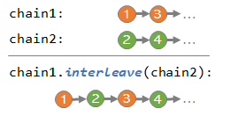

# Chainable


> :warning: Under construction / Work in progress...

- [Summary](#summary)
- [System Requirements](#system-requirements)
- [Usage (Maven)](#usage-maven)
- [Overview](#overview)
  - [Highlights](#highlights)
    - [Sequence Processing](#sequence-processing)
    - [Tree Processing](#tree-processing)
  - [Chainable vs Java Stream](#chainable-vs-java-stream)
- [Examples](#examples)
  - [Chains](#chain-examples)
  - [Trees](#tree-examples)

## Summary

*Chainables* is a set of fluent interface-style sub types of `Iterable` with a large selection of methods facilitating the use of the
functional programming, the iterator pattern and lazy evaluation, intended for achieving code that is more succinct, readable, simpler to implement
and sometimes faster than its non-lazy/non-functional equivalent.

It includes support for data structures such as:
 - **tree** (or trie) - (`ChainableTree`) enabling a number of lazy operations on trees defined in a functional-programming manner (including infinite trees)
 - **2-dimensional (2 key) map** (`Map2D`, `Map2DMultiValued`)
 - **list** -- see `ChainableList`
 - **queue** -- see `ChainableQueue`
 - and the `Chainable` interface itself, which is intended to be a rich, `Iterable`-based alternative to Java's `Stream` and Google's *guava*.
 
The implementation is lightweight, based on Java 8, self-contained, i.e. it has no external dependencies, so as not to contribute to any sub-dependency versioning challenges.

[Simple example](https://github.com/chainables/chainable/blob/7ff3056c0772b5b91a4eeaccf812b159f6611356/src/test/java/com/github/chainables/chainable/Examples.java#L30-L43)

```java
        import static com.github.chainables.chainable.Chainable.chain;
        // ...

        Chainable<String> chain =
                chain(0, 0, 0, 2, 3, 7, 0, 1, 8, 3, 13, 14, 0, 2)   // Integers
                    .notAsLongAs(i -> i == 0)                       // Ignore leading sub chain of 0s
                    .notAfter(i -> i == 13)                         // Stop after finding 13
                    .whereEither(                                   // Choose only those that...
                        i -> i % 2 == 0,                            // ...are even
                        i -> i > 6)                                 // ...or greater than 6
                    .transform(i -> Character.toString((char) (i + 65)));   // Transform into letters

        String text = chain.join();                                 // Merge into a string
        String textBackwards = chain.reverse().join();              // Reverse and merge into a string

        assertEquals("CHAIN", text);
        assertEquals("NIAHC", textBackwards);
```

## System requirements


- Java 8+

## Usage (Maven)


Add this to your POM's `<depedencies>`:

```xml
        <dependency>
            <groupId>com.github.chainables</groupId>
            <artifactId>chainable</artifactId>
            <version>[0.5,)</version>
        </dependency>
```

Also, for easier access, it is a good idea to add the following static import to the Java file:

```java
        import static com.github.chainables.chainable.Chainable.chain;
```

## Getting Started

A simple starting **chain** can be created using one of the factory methods on `Chainable`, such as [`from()`](https://www.javadoc.io/static/com.github.chainables/chainable/0.5.2/com/github/chainables/chainable/Chainable.html#from-T...-) or [`empty()`](https://www.javadoc.io/static/com.github.chainables/chainable/0.5.2/com/github/chainables/chainable/Chainable.html#empty-java.lang.Class-).

<details><summary>Example...</summary>

  ```java
        // From pre-defined values
        Chainable<String> chain1 = chain("a", "b", "c");

        // Empty but expecting String items
        Chainable<String> chain2 = chain(String.class);

        // From an existing Iterable<Foo>
        Chainable<Foo> chain3 = chain(existingIterable);

        // From an existing Stream<Foo>
        Chainable<Foo> chain4 = chain(existingStream);
  ```

</details>

A simple **tree** can be created using the [`withRoot()`](https://www.javadoc.io/static/com.github.chainables/chainable/0.5.2/com/github/chainables/chainable/ChainableTree.html#withRoot-T-) factory method.

<details><summary>Example...</summary>

  ```java
        // Example tree of String values
        ChainableTree<String> tree = ChainableTree.withRoot("root");
  ```

and then child sub-trees can be assigned to it either:
 - as explicitly pre-defined trees or values:
 
  ```java
        tree.withChildren(
                ChainableTree
                    .withRoot("1")
                    .withChildValues("1.1", "1.2"),
                ChainableTree
                    .withRoot("2")
                    .withChildValues("2.1", "2.2"));
  ```

 - or dynamically, using functional programming by providing a child-extracting lambda -- see the [tree processing example](#tree-processing), or more in the [Tree Examples](#tree-examples) section.
</details>

## Overview

### Highlights

In general, some of the current key highlights of the `Chainables` project include:

#### Tree processing

> :warning: Section under construction as the API is under active development/at pre-release stage.

Tightly integrated with `Chainable` chains, the functional programming-based tree (trie) support [`ChainableTree`](https://www.javadoc.io/doc/com.github.chainables/chainable/latest/com/github/chainables/chainable/ChainableTree.html) is a particularly distinguishing feature of the *Chainables* library. A chainable tree can be defined using a lazily-evaluated lambda in the [`withChildValueExtractor()`](https://www.javadoc.io/static/com.github.chainables/chainable/0.5.2/com/github/chainables/chainable/ChainableTree.html#withChildValueExtractor-java.util.function.Function-) method, which does not evaluate/traverse the children of a given parent until necessary. A number of capabilities stem from this:

  - **infinite trees**, or trees of infinite depth, can be easily defined in terms of children-generating lambdas. For example, the code below defines a lazily evaluated infinite tree made of all the possible permutations of the letters *a*, *b* and *c*, where each layer of the tree consists of nodes of increasingly longer strings:

```java
        char[] alphabet = { 'a', 'b', 'c' };                // Define alphabet to take letters from
        ChainableTree<String> permutations = ChainableTree
                .withRoot("")                               // Blank string at the root
                .withChildValueExtractor(p -> Chainable
                        .empty(String.class)                // Start with an empty chain of strings
                        .chainIndexed((s, i) -> p + alphabet[i.intValue()]) // Append each alphabet item to the parent
                        .first(alphabet.length));           // Limit the children chain to the size of the alphabet
```

   If you were to begin to traverse this infinite tree, its initial few layers would look like this:

  ```
- (blank root)
 - a
  - aa
   - aaa
     ...
  - ab
   - aba
     ...
  - ac
   - aca
     ...
 - b
  - ba
    ...
 - c
  - ca
    ...
```

 - **tree trimming** - Especially useful for infinite trees, a chainable tree can be limited in depth based on either:
   - a lazily evaluated predicate condition that the lowermost descendants are to meet, using [`notBelowWhere()`](https://www.javadoc.io/static/com.github.chainables/chainable/0.5.2/com/github/chainables/chainable/ChainableTree.html#notBelowWhere-java.util.function.Predicate-)
   - or taking into consideration the depth of the tree so far, using the `BiPredicate` flavor of [`notBelowWhere()`](https://www.javadoc.io/static/com.github.chainables/chainable/0.5.2/com/github/chainables/chainable/ChainableTree.html#notBelowWhere-java.util.function.BiPredicate-).

   This enables methods that may result in a full traversal of the tree (such as [`firstWhere()`])https://www.javadoc.io/static/com.github.chainables/chainable/0.5.2/com/github/chainables/chainable/ChainableTree.html#firstWhere-java.util.function.Predicate-)) to *eventually* return, which they might not otherwise do if the tree is infinite.

   For example, the following code, which builds on the previous example, results in a view of the previously defined tree that is limited to de-facto 3 layers of depth for any subsequent logic applied to it:

  ```java
        String text = permutations
                .notBelowWhere(t -> t.value().length() >= 3) // Limit permutation length to 3 letters
                .breadthFirst()                              // Create chain from breadth-first traversal
                .afterFirst()                                // Skip the empty root
                .join(", ");

        System.out.println(text);
```

   The beginning of the output text, which lists all the permutations of *a*, *b*, and *c*, up to 3 letters in length, will be: `a, b, c, aa, ab, ac, ba, bb, bc, ca, cb, cc, aaa, aab, ...`

- **sub-tree "transparency"** - :triangular_flag_on_post: To do

- **breadth/depth-first traversals** - :triangular_flag_on_post: To do

> :triangular_flag_on_post: To do...

#### Sequence processing

> :warning: Section under construction as the API is under active development/at pre-release stage.

   - **single pass caching** - By default, each re-iteration over a given chain re-evaluates the specified lambdas. But using the [`cached()`](https://www.javadoc.io/static/com.github.chainables/chainable/0.5.2/com/github/chainables/chainable/Chainable.html#cached--) method, you can create a chain that is lazily evaluated only on the first complete pass, when it is iterated all the way to the end, assuming it is not infinite. From then on, subsequent iterations over the same chain would only navigate through the internally cached outputs of that initial pass, no longer evaluating the provided lambdas. This means the cached chain, upon subsequent traversals, starts behaving de-facto like a `List`.

   - **interleaving** - Two or more chains that have their own evaluation logic can be interleaved using the [`interleave()`](https://www.javadoc.io/static/com.github.chainables/chainable/0.5.2/com/github/chainables/chainable/Chainable.html#interleave-java.lang.Iterable...-) method,
so that a subsequent chain can apply its logic to their outputs in a quasi-parallel (or sequential round-robin) fashion, while still not actually being concurrent.

     

  - **breadth-first / depth-first traversal** - You can achieve a tree-like traversal of a chain, where children of each item extracted by the child-extracting lambda are inserted immediately ahead [`depthFirst()`](https://www.javadoc.io/static/com.github.chainables/chainable/0.5.2/com/github/chainables/chainable/Chainable.html#depthFirst-java.util.function.Function-) or appended to the end of the chain [`breadthFirst()`](https://www.javadoc.io/static/com.github.chainables/chainable/0.5.2/com/github/chainables/chainable/Chainable.html#breadthFirst-java.util.function.Function-), thereby resulting in a pre-order/depth-first or breadth-first traversal respectively.

  - **crossing** - Using the `cross()` method, you can cross two chains to create one chain that iterates through all the pairs of the members of the two input chains, in a lazily evaluated fashion.

  - **disjunctive filtering** - Using the [`whereEither()`](https://www.javadoc.io/static/com.github.chainables/chainable/0.5.2/com/github/chainables/chainable/Chainable.html#whereEither-java.util.function.Predicate...-) method, you can specify one or more filter predicates at the same time, with disjunctive (logical-OR) semantics. This means you can define specific filtering predicates for specific purposes and then just supply them all as parameters, rather than having to create yet another predicate that's an *OR* of the others.

  - **skipping** of the leading sub-chain of items under various scenarios, e.g.:
    - skip as long as they satisfy a condition using [`notAsLongAs()`](https://www.javadoc.io/static/com.github.chainables/chainable/0.5.2/com/github/chainables/chainable/Chainable.html#notAsLongAs-java.util.function.Predicate-)
    - skip before they satisfy a condition using [`notBefore()`](https://www.javadoc.io/static/com.github.chainables/chainable/0.5.2/com/github/chainables/chainable/Chainable.html#notBefore-java.util.function.Predicate-)
  
  - **trimming** of the trailing sub-chain of items under various scenario, e.g.:
    - stop right before the specified condition is satisfied using [`before()`](https://www.javadoc.io/static/com.github.chainables/chainable/0.5.2/com/github/chainables/chainable/Chainable.html#before-java.util.function.Predicate-)
    - or as soon as it is no longer satisfied using [`asLongAs()`](https://www.javadoc.io/static/com.github.chainables/chainable/0.5.2/com/github/chainables/chainable/Chainable.html#asLongAs-java.util.function.Predicate-)

  - **equality and sub-array containment checks**, evaluated lazily. Chain comparison using the equality [`equals()`](https://www.javadoc.io/static/com.github.chainables/chainable/0.5.2/com/github/chainables/chainable/Chainable.html#equals-java.lang.Iterable-) test or the sub-array containment [`containsSubarray()`](https://www.javadoc.io/static/com.github.chainables/chainable/0.5.2/com/github/chainables/chainable/Chainable.html#containsSubarray-java.lang.Iterable-) tests return quickly, without traversing/evaluating the rest of the chain.

  - chainable **string joining/splitting** operations - You can get a chain of tokens or characters out of a string with `Chainable`'s [`split()`](https://www.javadoc.io/static/com.github.chainables/chainable/0.5.2/com/github/chainables/chainable/Chainables.html#split-java.lang.String-java.lang.String-boolean-) method, process it using various `Chainable` APIs and go back to a string using [`join()`](https://www.javadoc.io/static/com.github.chainables/chainable/0.5.2/com/github/chainables/chainable/Chainable.html#join-java.lang.String-).
</details>

#### Two-dimensional Maps

> :warning: To do

### Chainable vs Java Stream

Although *Chainable* overlaps with Java's `Stream` in some areas of functionality, the design of *Chainable* is optimized for a somewhat different set of goals, manifested in a number of design and functional differences:

- Unlike streams, `Chainable` derives from `Iterable` to simplify usage inside the *for-each* flavor of the `for` loop.

- By virtue of deriving from `Iterable`, chains are **"re-entrant"** in the sense that multiple iterators can be instantiated against the same chain.

- Unlike Java's streams, the *Chainables* library also provides **functional programming-based API for trees** (or more specifically, *tries*), seamlessly integrated with the `Chainable` sequence processing API (see [`ChainableTree`](https://www.javadoc.io/doc/com.github.chainables/chainable/latest/com/github/chainables/chainable/ChainableTree.html)), as well as other (future) basic data structures.

- `Chainable` supports caching of the already evaluated items in the chain, if that is what the programmer chooses to enable (see [`cached()`](https://www.javadoc.io/static/com.github.chainables/chainable/0.5.2/com/github/chainables/chainable/Chainable.html#cached--)). This can be especially useful if the underlying sequence is not expected to change before subsequent traversals, or if it is wrapping a Java `Stream` (which itself by definition is not re-entrant.)

- `Chainable` exposes various additional convenience methods for sequential processing with functional programming that are not present in streams.

- While some of the overlapping APIs in Java's `Stream` are only available starting with Java 9, `Chainable` is **fully functional starting with Java 8**.

- `Chainable` is not (currently) oriented toward the parallelism that was a key guiding design principle behind Java's `Stream`.

Functional and design differences with streams aside, a level of interoperability between `Stream` and `Chainable` exists: a chain can be created from a stream using [`from(Stream)`](https://www.javadoc.io/static/com.github.chainables/chainable/0.5.2/com/github/chainables/chainable/Chainable.html#from-java.util.stream.Stream-), and vice-versa using [`stream()`](https://www.javadoc.io/static/com.github.chainables/chainable/0.5.2/com/github/chainables/chainable/Chainable.html#stream--). A chain wrapping a stream makes the stream *appear* reentrant, even though in reality it is traversed only once under the hood. That is because the chain wrapper for the stream automatically caches the already evaluated stream items and only accesses the underlying stream for not yet visited items.

## Examples

### Tree Examples

#### Breadth-first traversal

> :triangular_flag_on_post: To do...

#### Finding an item matching some criteria

> :triangular_flag_on_post: To do...

#### Infinite tree of permutations of 3 letters

In this example, an infinite tree is defined with a child extracting lambda that generates strings as permutations of letters from the specified alphabet (*a, b, c*) of increasingly greater length. Then, a "view" of the tree is defined, limiting its depth to 4 layers (including the empty root). Finally, it is transformed into a string listing of all the permutations:

  ```java
        char[] alphabet = { 'a', 'b', 'c' };                // Define alphabet to take letters from
        ChainableTree<String> permutations = ChainableTree
                .withRoot("")                               // Blank string at the root
                .withChildValueExtractor(p -> Chainable
                        .empty(String.class)                // Start with an empty chain of strings
                        .chainIndexed((s, i) -> p + alphabet[i.intValue()]) // Append each alphabet item to the parent
                        .first(alphabet.length));           // Limit the children chain to the size of the alphabet

        String text = permutations
                .notBelowWhere(t -> t.value().length() >= 3) // Limit permutation length to 3 letters
                .breadthFirst()                              // Create chain from breadth-first traversal
                .afterFirst()                                // Skip the empty root
                .join(", ");

        System.out.println(text);
  ```

The beginning of the output text here, which lists all the permutations of *a*, *b*, and *c* up to 3 letters in length, will be: `a, b, c, aa, ab, ac, ba, bb, bc, ca, cb, cc, aaa, aab, ...`

> :triangular_flag_on_post: To do...

### Chain Examples

#### Fibonacci Sequence

  In this example, each next item is the sum of the previous two preceding it in the chain:

  ```java
        String fibonacciFirst8 = chain(0l, 1l)  // Starting values for Fibonacci
                .chain((i0, i1) -> i0 + i1)     // Generate next Fibonacci number
                .first(8)                       // Take first 8 items
                .join(", ");                    // Merge into a string

        assertEquals("0, 1, 1, 2, 3, 5, 8, 13", fibonacciFirst8);        
  ```

  The flavor of the `chain()` method used above feeds the user-specified lambda with the two preceding items.

#### Interleaving two chains

  In this examples, a chain of odd numbers is interleaved with a chain of even numbers to produce a chain of natural numbers:

  ```java
    // Define infinite chain of odd numbers starting with 1
    final Chainable<Long> odds = chain(1l).chain(o -> o + 2);

    // Define infinite chain of even numbers starting with 2
    final Chainable<Long> evens = chain(2l).chain(o -> o + 2);

    String naturals = odds
        .interleave(evens) // Interleave odds with evens
        .first(10)         // Take the first 10 items 
        .join(", ");       // Merge into a string

    assertEquals("1, 2, 3, 4, 5, 6, 7, 8, 9, 10", naturals);
  ```

> :triangular_flag_on_post: To do...

### Two-dimensional Map Examples

> :triangular_flag_on_post: To do...

### Traversing all permutations of items from two chains

> :triangular_flag_on_post: To do...
